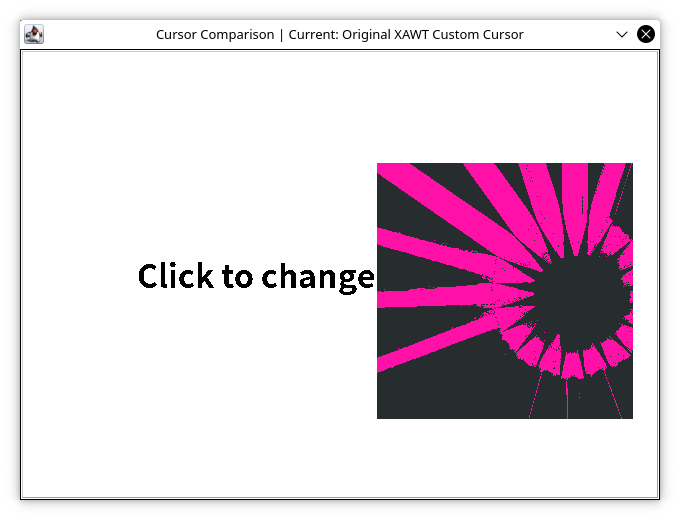
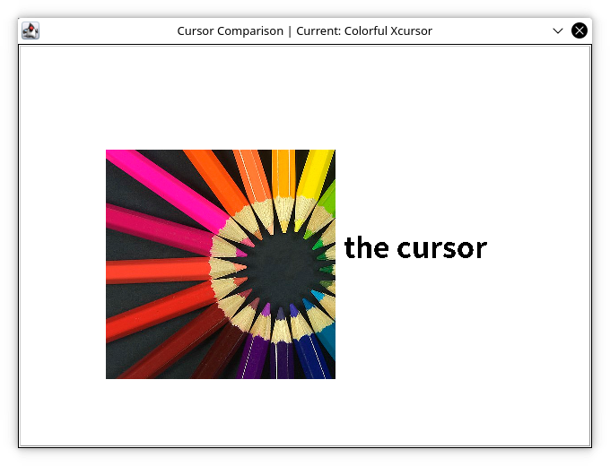

# Colorful Xcursor
Colorful custom cursor support for Java XAWT (AWT/X11)

## Add the library to your project (gradle)
1. Add the Maven Central repository (if not exist) to your build file:
```groovy
repositories {
    ...
    mavenCentral()
}
```

2. Add the dependency:
```groovy
dependencies {
    ...
    implementation 'com.tianscar.awt.x11:colorful-xcursor:1.1.1'
}
```

### Running on Java 16+
Add the following lines to the JVM args:
```
--add-exports java.desktop/sun.awt=ALL-UNNAMED
--add-exports java.desktop/sun.awt.X11=ALL-UNNAMED
```

## Usage
```java
Cursor imageCursor   = ColorfulXCursor.createImageCursor(Image cursor, Point hotSpot, String name);
Cursor fontCursor    = ColorfulXCursor.getFontCursor(int type);
Cursor libraryCursor = ColorfulXCursor.getLibraryCursor(String name);
```
[JavaDoc](https://docs.tianscar.com/colorful-xcursor)  
[A simple example](src/test/java/com/tianscar/awt/colorfulxcursor/test/XCursorComparison.java)

## Comparison



## License
[MIT](/LICENSE) (c) Tianscar  

### Dependencies
[jnr-ffi](https://github.com/jnr/jnr-ffi) [Apache-2.0](https://github.com/jnr/jnr-ffi/blob/master/LICENSE)

### Resources be used for test
[pencils.jpg](src/test/resources/pencils.png) is cropped from https://en.wikipedia.org/wiki/Color#/media/File:Colouring_pencils.jpg,
the source image licensed under CC-BY-SA.